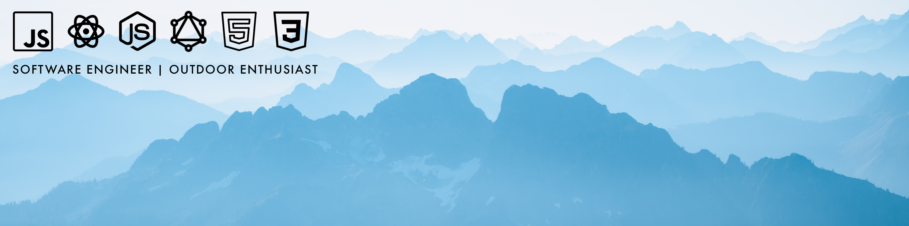

    
    
    

Full stack software engineer + rock climber + photographer
--------------------------------------------------------------

I'm a software engineer with five years of professional experience specializing in front-end technologies and developing software platforms. I bring a performance-centric approach to my work in that I like to focus around performance optimizations and possess an understanding of the underlying technologies and methodologies to achieve optimal performance; ensuring software solutions run efficiently, respond quickly and deliver seamless user experiences.

Throughout my career, I find that I value cross-functionally, collaborating with designers, product managers, and stakeholders to meet project objectives and delivery outstanding results. I like wearing different hats; tackling on new responsibilities, adapting to adversity, and driving positive change. 

I am passionate about cultivating a positive workplace environment and fostering collaboration that celebrates learning and growth for all. 

To get a better idea of me, here are my core values:

Kindness | Connection | Adaptability | Courage | Integrity | Creativity

--------------------------------------------------------------
* 🌲 I live in Seattle, WA
* 🧠 I specialize in React + TypeScript + GraphQL + Node + Redux
* 🧐 I am currently learning about AI Development + Machine Learning with Python
* 📧 You can contact me at [francis.t.ngo@gmail.com](mailto:francis.t.ngo@gmail.com)
* ⚡ In my freetime, I enjoy climbing, hiking, photography, making camp & cook videos, maintaining health, reading, exploring new food and coffee shops. 
* Fun Fact: I lived on the road for two years. I've been to 29 National Parks and know the best hot spring locations 😉